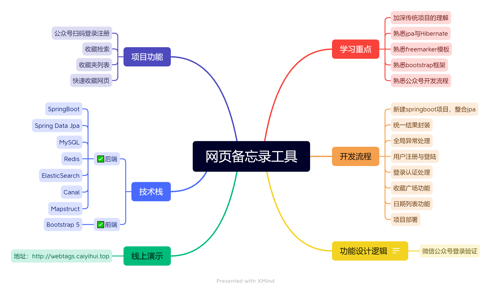
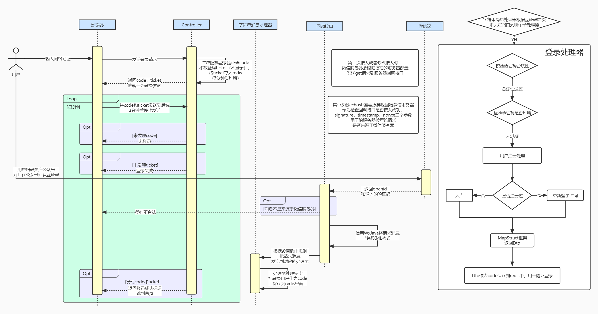

## 网页备忘录工具

#### 项目功能

- 公众号扫码登录注册
- 收藏检索
- 收藏夹列表
- 快速收藏网页

#### 技术栈

##### ✅后端

- SpringBoot
- Spring Data Jpa
- MySQL
- Redis
- ElasticSearch
- Canal
- Mapstruct

##### ✅前端

- Bootstrap 5

#### 线上演示

- 地址：http://webtags.caiyihui.top

#### 学习重点

- 加深传统项目的理解
- 熟悉jpa与Hibernate
- 熟悉freemarker模板
- 熟悉bootstrap框架
- 熟悉公众号开发流程

#### 开发流程

- 新建springboot项目，整合jpa
- 统一结果封装
- 全局异常处理
- 用户注册与登陆
- 登录认证处理
- 收藏广场功能
- 日期列表功能
- 项目部署

#### 功能设计逻辑

✅公众号扫码登录注册

- 

#### 开发笔记

- [网页收藏工具开发笔记](https://gitee.com/ethan1996/webtags/blob/master/%E7%BD%91%E9%A1%B5%E6%94%B6%E8%97%8F%E5%B7%A5%E5%85%B7%E5%BC%80%E5%8F%91%E7%AC%94%E8%AE%B0.md)
