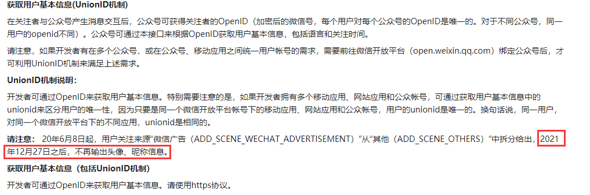
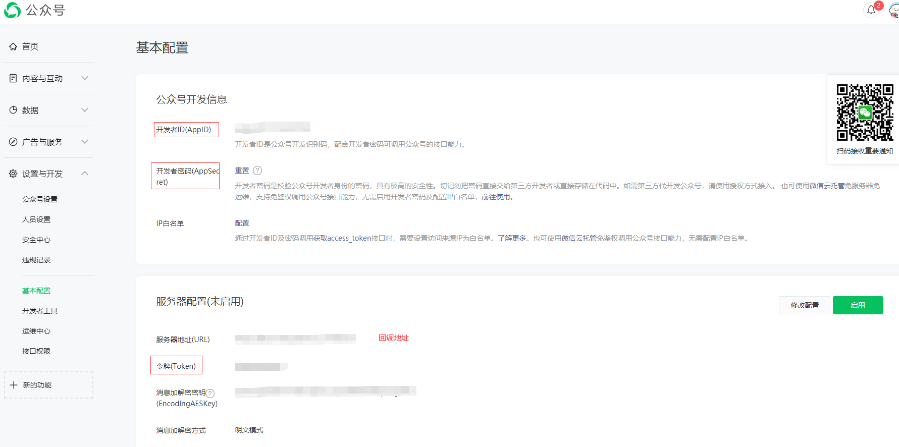
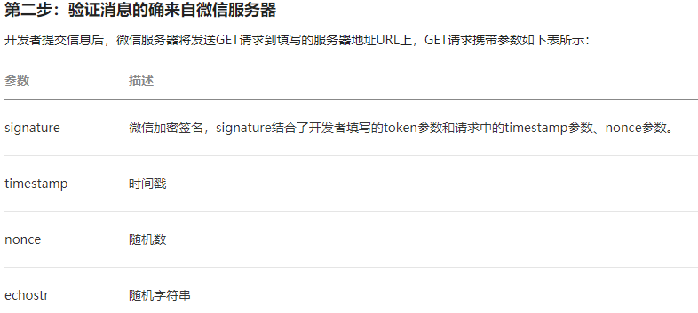
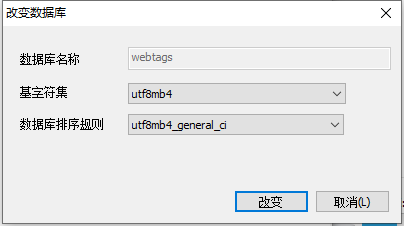
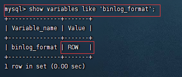
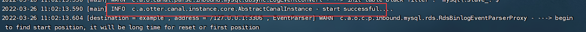

## 	网页备忘录工具开发笔记

### 遇到的问题

#### ⭐JPA 

- 方言问题
  - 解决版本：JAP增加database-platform属性
- JpaRepository
  - <font color="red">注意，继承JpaRepository接口支持简单的 CRUD 操作，原理大概是通过方法名和泛型映射。重要的来了！！！方法名是严格按照驼峰映射到表，在继承了JpaRepository接口的情况下，没有严格书写驼峰命名规则的方法无法正常启动Spring容器。自行百度Hibernate命名策略</font> 
  - 参考
    - 文档：[链接](https://www.cnblogs.com/bodhitree/p/9468585.html)


#### ⭐SpringMVC自动跳转

- 参考笔记
  - Spring.md--⭐自定义视图解析器：[链接]()
- 小结
  - 查阅了一下资料，猜测应该是freemarker与springmvc有整合


#### ⭐接入微信公众平台开发

- 微信公众号接口改版后无法获取头像和昵称

  - 

  - 解决方案【未完成】：[链接](https://www.cnblogs.com/yzeng/p/15767349.html)
- 接入微信端成功后，需要在服务器配置出启动才能从公众号获取消息


#### ⭐freemarker

- 如果在引入宏的时候如`***.ftl`，如果该宏不存在或者找不到，整个ftl网页都会失效，而不是像html照片仅仅是丢失，猜测应该是没有对异常进行处理导致后续不能运行

  - ```java
    freemarker.core._MiscTemplateException: Template inclusion failed (for parameter value "/***/***.ftl"):
    Template not found for name "/inc/collect-tpl.ftl".
    ```


#### ⭐mapstruct

- dto实体忘了加@Data，导致无法将原来的实体转成dto


#### ⭐elasticsearch

- elasticsearch添加index时索引名不能有大写字母，必须为lower小写字母

- 加入ik分词后还得重启一次

- es插件文件夹不能有压缩包，如：解压后的压缩包未删除

- 转换日期失败

  - 示例

    - ```java
      Unable to convert value '2022-03-26T21:57:09+08:00' to java.time.LocalDateTime for property 'created'
      ```

  - 原理

    - ```java
      ////需要精确到后面小数三位才能转换成功
      //2022-03-27T00:35:53+08:00 		转换失败
      //2022-01-19T18:57:01.317+08:00		转换成功
      ```

  - 解决办法，在转换之前，先格式化时间

    - ```java
      @Field(type = FieldType.Date, format = DateFormat.custom, pattern = "yyyy-MM-dd'T'HH:mm:ssz")
      private LocalDateTime created;
      ```


### 微信公众号开发

#### ⭐填写公众号配置

- 


#### ⭐在项目创建回调方法

- 

- 使用4个参数名或者`HttpServletRequest `都可以获取到他们的值，SpringMVC会根据名称自动映射匹配

- <font color="red">需要注意的是，使用4个参数需要严格区分大小写的，同时都需要将echostr随机字符串返回给微信服务器端</font> 

  - ```java
    @GetMapping("/wx/back")
    @ResponseBody
    public String wxClasBlock(String signature,String timestamp,String nonce,String echostr){
        return echostr;
    }
    ```


### 第三方包

#### ⭐WxJava

##### ✅ 概述

- 概述：微信开发 JavaSDK
- 开源地址
  - GitHub：[链接](https://github.com/wechat-group/WxJava)
  - Gitee：[链接](https://gitee.com/binary/weixin-java-tools)

##### ✅ 文档

- GitHub：[链接](https://github.com/Wechat-Group/WxJava/wiki/%E5%85%AC%E4%BC%97%E5%8F%B7%E5%BC%80%E5%8F%91%E6%96%87%E6%A1%A3)
- JavaDoc：[链接](http://binary.ac.cn/weixin-java-mp-javadoc/)


#### ⭐mapstruct

##### ✅概述

- MapStruct是一个用于生成类型安全，高性能和无依赖的bean映射代码的注释处理器

- 官网：[链接](https://mapstruct.org/)
- 注意：可能会跟lombok冲突

##### ✅使用说明

- 未映射属性策略：忽略

  - ```java
    @Mapper(componentModel = "spring", unmappedTargetPolicy = ReportingPolicy.IGNORE)
    public interface UserMapper {
        UserDto toDto(User user);
    }
    ```


- 将CollectMapper中包含User的数据也转成dto

  - ```java
    @Mapper(componentModel = "spring", uses = {UserMapper.class}, unmappedTargetPolicy = ReportingPolicy.IGNORE)、
    public interface CollectMapper {
    }
    ```


- 如果目标源没有get，set方法名ze无法对应，通过@Mappings-@Mapping指定映射关系

  - ```java
    @Mapper(componentModel = "spring", unmappedTargetPolicy = ReportingPolicy.IGNORE)
    public interface CollectDocMapper {
        @Mappings({
                @Mapping(source = "userId", target = "user.id"),
                @Mapping(source = "userAvatar", target = "user.avatar"),
                @Mapping(source = "username", target = "user.username")
        })
        CollectDto toDto(CollectDoc collectDoc);
    }
    ```

    

#### ⭐layui

- 参考文档：[链接](https://www.layuiweb.com/doc/modules/flow.html)


### 部署

#### ⭐Docker

- 版本：` 20.10.13`


#### ⭐MySQL

##### ✅环境

- 安装环境：Linux
- 版本：`MySQL 5.7.37`
- 需要注意的是从5.7.18开始官方不再二进制包中提供my-default.cnf文件，即etc下没有实体文件，参考mysql官网文档：[链接](https://dev.mysql.com/doc/refman/5.7/en/binary-installation.html)


##### ✅创建需要的数据库

- 


##### ✅配置Binlog

- 打开配置文件

  - ```linux
    cd /etc
    vim my.cnf
    ```

- 增加以下配置项（binlog三种模式，选择`row`）

  - <font color="red">【注意！！！缺少`[mysqld]`配置不能生效】</font> 

  - ```linux
    [mysqld]
    log-bin=mysql-bin # 开启Binlog
    binlog-format=ROW # 设置ROW格式
    server_id=1  #mysql主从备份serverId,canal中不能与此相同
    ```

- 重启mysql服务

  - ```mysql
    service mysql restart
    ```

- 进入mysql，输入root密码

  - ```mysql
    mysql -uroot -p
    ```

- 查看binlog文件

  - ```mysql
    show master status;
    ```

- 重启日志

  - ```mysql
    reset master;
    ```

- 检查是否配置成功

  - ```mysql
    show variables like 'binlog_format';
    ```

  - 


#### ⭐Elasticsearch

##### ✅Docker部署

- docker拉取并创建容器

  - ```
    docker pull elasticsearch:7.16.2
    
    docker run -p 9200:9200 -p 9300:9300 -e "discovery.type=single-node" --name='es7162' -d elasticsearch:7.16.2
    ```

  - 需要注意的是，ES很吃内存

  - 

- 进入容器修改配置文件

  - elasticsearch.yml

    - ```linux
      docker exec -ites es7162 /bin/bash
      vim config/elasticsearch.yml
      ```
      
    - ```yaml
      cluster.name: YH-es  #配置集群的标识
      network.host: 0.0.0.0
      
      node.name: node-1  #节点名称
      http.port: 9200 
      http.cors.enabled: true  #允许跨域
      http.cors.allow-origin: "*"  #允许所有资源跨域
      node.master: true 
      node.data: true
      ```

- 调整es内存大小

  - ```linux
    vim jvm.options
    ```

  - ```
    ## The heap size is automatically configured by Elasticsearch
    ## based on the available memory in your system and the roles
    ## each node is configured to fulfill. If specifying heap is
    ## required, it should be done through a file in jvm.options.d,
    ## and the min and max should be set to the same value. For
    ## example, to set the heap to 4 GB, create a new file in the
    ## jvm.options.d directory containing these lines:
    ##
    -Xms800m  #启动时分配的内存
    -Xmx800m  #运行过程中分配的最大内存,如果超过了,则报:oo
    ##
    ## See https://www.elastic.co/guide/en/elasticsearch/reference/7.16/heap-size.html
    ## for more information
    ```

- 正常启动后，开放9200端口，就能访问服务器的ES了

  - 远程下载ik分词器，重启即可刷新ik插件

  - ```linux
    docker exec -ites es7162 /bin/bash
    
    ./bin/elasticsearch-plugin install https://github.com/medcl/elasticsearch-analysis-ik/releases/download/v7.16.2/elasticsearch-analysis-ik-7.16.2.zip
    ```


##### ✅Linux部署

- 远程下载和解压【8.1.1】为例

  - ```
    wget https://artifacts.elastic.co/downloads/elasticsearch/elasticsearch-8.1.1-darwin-x86_64.tar.gz
    wget https://artifacts.elastic.co/downloads/elasticsearch/elasticsearch-8.1.1-darwin-x86_64.tar.gz.sha512
    shasum -a 512 -c elasticsearch-8.1.1-darwin-x86_64.tar.gz.sha512 
    tar -xzf elasticsearch-8.1.1-darwin-x86_64.tar.gz
    cd elasticsearch-8.1.1/
    ```

- 解压后的文件夹移动到user目录下，如`/usr/local/`

- ES默认是不能用root用户启动的，所以需要创建一个用户

  - ```
    #1、创建用户：elasticsearch
    [root@yhblog elasticsearch-8.1.1]# adduser elasticsearch
    
    #2、创建用户密码，需要输入两次
    [root@yhblog elasticsearch-8.1.1]# passwd elasticsearch
    
    #3、将对应的文件夹权限赋给该用户
    [root@yhblog elasticsearch-8.1.1]#  chown -R elasticsearch /usr/local/elasticsearch-8.1.1
     　　
    #4、切换至elasticsearch用户
    [root@yhblog elasticsearch-8.1.1]# su elasticsearch
    
    #5、进入启动目录启动 
    [elasticsearch@yhblog elasticsearch-8.1.1]$ ./bin/elasticsearch
    ```

##### ✅测试

- 索引

  - ```json
    {
        "mappings": {
            "properties": {
                "collected": {
                    "type": "date",
                    "format": "date_optional_time||epoch_millis"
                },
                "created": {
                    "type": "date",
                    "format": "date_optional_time||epoch_millis"
                },
                "note": {
                    "type": "text",
                    "analyzer": "ik_max_word",
                    "search_analyzer": "ik_smart"
                },
                "personal": {
                    "type": "integer"
                },
                "title": {
                    "type": "text",
                    "analyzer": "ik_max_word",
                    "search_analyzer": "ik_smart"
                },
                "url": {
                    "type": "text"
                },
                "userAvatar": {
                    "type": "text"
                },
                "userId": {
                    "type": "long"
                },
                "username": {
                    "type": "keyword"
                }
            }
        }
    }
    ```

- 文档

  - ```json
    {
        "created":"2022-01-19T18:57:01.317+08:00",
        "created":"2022-03-01",
        "personal":"0",
        "title":"关注公众号：微如萤火亦是光",
        "url":"caiyihui.top",
        "userId":"5",
        "username":"蔡先生",
        "userAvatar":"http://syemfn.natappfree.cc/images/avatar.jpg"
    }
    ```

  


#### ⭐安装Canal-Server

##### ✅Docker部署

- 拉取镜像并启动【需要指定实例网络模式为 `host`，而不是`link`】

  - ```
    docker pull canal/canal-server:v1.1.5
    
    docker run --name canal115 -p 11111:11111  --net host -id canal/canal-server:v1.1.5
    ```

- 进入docker修改Canal配置文件

  - ```
    docker exec -it canal115 /bin/bash
    cd canal-server/conf/example/
    
    vi instance.properties
    
    #################################################
    ## mysql serverId , v1.0.26+ will autoGen
    canal.instance.mysql.slaveId=10 # 把0改成10，只要不和mysql的id相同就行
    
    # username/password
    canal.instance.dbUsername=root
    canal.instance.dbPassword= #MySQL的root密码
    ```
    
  
- 退出重启

- 查看日志是否成功启动

  - ```
    docker exec -it canal115 /bin/bash
    cd canal-server/logs/example/
    tail -100f example.log
    ```
  
  - 


##### ✅测试远程canal是否连接成功

- 依赖

  - ```xml
    <dependency>
       <groupId>com.alibaba.otter</groupId>
       <artifactId>canal.client</artifactId>
       <version>1.1.4</version>
    </dependency>
    ```
  
- 测试类

  - ```java
    @SpringBootTest
    public class SimpleCanalClientExample {
    
        @Test
        public void main() {
            // 创建链接
            CanalConnector connector = CanalConnectors.newSingleConnector(new InetSocketAddress("你的服务器ip",
                    11111), "example", "", "");
            int batchSize = 1000;
            int emptyCount = 0;
            try {
                connector.connect();
                connector.subscribe(".*\\..*");
                connector.rollback();
                int totalEmptyCount = 120;
                while (emptyCount < totalEmptyCount) {
                    Message message = connector.getWithoutAck(batchSize); // 获取指定数量的数据
                    long batchId = message.getId();
                    int size = message.getEntries().size();
                    if (batchId == -1 || size == 0) {
                        emptyCount++;
                        System.out.println("empty count : " + emptyCount);
                        try {
                            Thread.sleep(1000);
                        } catch (InterruptedException e) {
                        }
                    } else {
                        emptyCount = 0;
                        // System.out.printf("message[batchId=%s,size=%s] \n", batchId, size);
                        printEntry(message.getEntries());
                    }
                    connector.ack(batchId); // 提交确认
                    // connector.rollback(batchId); // 处理失败, 回滚数据
                }
                System.out.println("empty too many times, exit");
            } finally {
                connector.disconnect();
            }
        }
        public void printEntry(List<CanalEntry.Entry>  entrys) {
            for (CanalEntry.Entry entry : entrys) {
                if (entry.getEntryType() == CanalEntry.EntryType.TRANSACTIONBEGIN || entry.getEntryType() == CanalEntry.EntryType.TRANSACTIONEND) {
                    continue;
                }
                CanalEntry.RowChange rowChage = null;
                try {
                    rowChage = CanalEntry.RowChange.parseFrom(entry.getStoreValue());
                } catch (Exception e) {
                    throw new RuntimeException("ERROR ## parser of eromanga-event has an error , data:" + entry.toString(),
                            e);
                }
                CanalEntry.EventType eventType = rowChage.getEventType();
                System.out.println(String.format("================> binlog[%s:%s] , name[%s,%s] , eventType : %s",
                        entry.getHeader().getLogfileName(), entry.getHeader().getLogfileOffset(),
                        entry.getHeader().getSchemaName(), entry.getHeader().getTableName(),
                        eventType));
                for (CanalEntry.RowData rowData : rowChage.getRowDatasList()) {
                    if (eventType == CanalEntry.EventType.DELETE) {
                        printColumn(rowData.getBeforeColumnsList());
                    } else if (eventType == CanalEntry.EventType.INSERT) {
                        printColumn(rowData.getAfterColumnsList());
                    } else {
                        System.out.println("-------> before");
                        printColumn(rowData.getBeforeColumnsList());
                        System.out.println("-------> after");
                        printColumn(rowData.getAfterColumnsList());
                    }
                }
            }
        }
        public void printColumn(List<CanalEntry.Column> columns) {
            for (CanalEntry.Column column : columns) {
                System.out.println(column.getName() + " : " + column.getValue() + "    update=" + column.getUpdated());
            }
        }
    }
    ```


#### ⭐安装Client-Adapter

- 拉取一个第三方包

  - mysql和canal用的都是主机网络，所以adapter也使用host好了

  - ```
    docker pull slpcat/canal-adapter:v1.1.5
    
    docker run --name adapter115 -p 8081:8081 --net host -d slpcat/canal-adapter:v1.1.5
    ```

- 进入docker中修改配置

  - ```
    docker exec -it adapter115 /bin/bash
    
    cd conf/
    vi application.yml
    ```

- 由于canal-server用的是主机网络和端口11111，所以不需要修改

  - ```yaml
    server:
      port: 8081
    spring:
      jackson:
        date-format: yyyy-MM-dd HH:mm:ss
        time-zone: GMT+8
        default-property-inclusion: non_null
    
    canal.conf:
      mode: tcp #tcp kafka rocketMQ rabbitMQ
      flatMessage: true
      zookeeperHosts:
      syncBatchSize: 1000
      retries: 0
      timeout:
      accessKey:
      secretKey:
      consumerProperties:
        # canal tcp consumer
        canal.tcp.server.host: 127.0.0.1:11111
        canal.tcp.zookeeper.hosts:
        canal.tcp.batch.size: 500
        canal.tcp.username:
        canal.tcp.password:
    
      srcDataSources:
        defaultDS:
          url: jdbc:mysql://127.0.0.1:3306/webtags?useUnicode=true&useSSL=false&characterEncoding=utf-8&autoReconnect=true&serverTimezone=Asia/Shanghai
          username: root
          password: #MySQL的root密码
      canalAdapters:
      - instance: example # canal instance Name or mq topic name
        groups:
        - groupId: g1
          outerAdapters:
          - name: logger
          - name: es7 #注意是es7
            hosts: 127.0.0.1:9200
            properties:
              mode: rest
              cluster.name: YH-es #配置集群的标识 
    ```

- 修改表映射索引文件【同步触发条件】

  - ```
    docker exec -it adapter115 /bin/bash
    cd conf/es7
    
    #复制当前目前的mytest_user.yml，作为触发配置文件
    cp -v mytest_user.yml YH-es_collect.yml
    
    # 删除剩余的配置文件
    rm -rf biz_order.yml customer.yml mytest_user.yml
    
    #编辑
    vi YH-es_collect.yml
    ```

  - ```yaml
    dataSourceKey: defaultDS
    destination: example
    groupId: g1
    esMapping:
      _index: yh_collect #项目对应的索引的名称
      _id: _id
      upsert: true
    #  pk: id
      sql: "
      
    SELECT
            c.id AS _id, #_id为文档的id
            c.user_id AS userId,
            c.title AS title,
            c.url AS url,
            c.note AS note,
            c.collected AS collected,
            c.created AS created,
            c.personal AS personal,
            u.username AS username,
            u.avatar AS userAvatar
    FROM
            collect c
    LEFT JOIN user u ON c.user_id = u.id
      
     "
    #  objFields:
    #    _labels: array:;
      etlCondition: "where a.c_time>={}"
      commitBatch: 3000
    
    ```

- 重启即可生效，查看adapter是否成功启动

  - ```
    docker logs --tail 100  -f adapter115
    ```


#### ⭐注意事项

- 如果使用容器之间的桥接网络，需要注意容器的启动顺序
  - MySQL -->ES --> canal --> adapter
